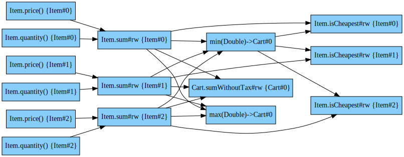
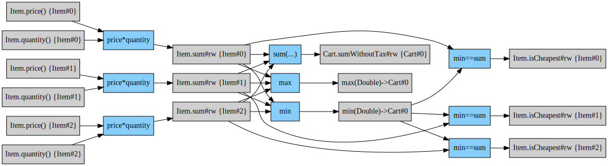

# How to execute Calculations on Immutable Object Trees

If you want to so some calculations in object trees, things can get messy. To make things easier, we can use a graph to
determine where to start and how to propagate further, we separate calculation and procurement and mix even validation
into that. Each calculation must declare which value is calculated and which dependencies are used for this:

```java
public interface Value<T> {

  default <B> Related<T, B> relatedTo(B base) {
    return Related.to(this, base);
  }

  static <T> Named<T> ofType(Class<T> type) {
    return Named.ofType(type);
  }
  static <T> Named<T> named(String name, Class<T> type) {
    return Named.named(name, type);
  }
  static <T> Unvalidated<T> unvalidated(ValueSource<T> source) { return Unvalidated.wrap(source); }
}
```
As you can provide your own implementation, each value must implement `hashcode/equals` (see [What is a Value](WhatIsAValue.md) for more).

In this sample we use an immutable shopping cart which we change with the calculation result..

As this stuff should run on java 8, we use [immutables.github.io](https://immutables.github.io) instead of Lombok or java records.

## Let's create a Shopping Cart                                                                                              

We need an item class, which stores properties like `quantity` and `price`.

```java
@Value.Immutable
public interface Item extends ChangeableInstance<Item>, HasRules {
  CopyOnChangeProperty<Item, Double> sumProperty = copyOnChange(Item.class, "sum", Item::sum, (item, value) -> ImmutableItem.copyOf(item).withSum(value));
  ReadOnlyProperty<Item, Double> priceProperty = readOnly(Item.class, "price", Item::price);
  ReadOnlyProperty<Item, Integer> quantityProperty = readOnly(Item.class, "quantity", Item::quantity);
  CopyOnChangeProperty<Item, Boolean> isCheapestProperty = copyOnChange(Item.class, "isCheapest", Item::isCheapest, (item, value) -> ImmutableItem.copyOf(item).withIsCheapest(value));

  @Value.Default
  @Override
  default Id<Item> id() {
    return Id.idFor(Item.class);
  }

  @Nullable String name();

  @Nullable Integer quantity();

  @Nullable Double price();

  @Nullable Double sum();

  @Nullable Boolean isCheapest();

  @Override
  default <T> Item change(ChangeableValue<?, T> id, T value) {
    if (id.id().equals(id())) {
      return ((ChangeableValue<Item, T>) id).change(this, value);
    }
    return this;
  }

  @Override
  default <T> Maybe<T> findValue(ReadableValue<?, T> id) {
    if (id.id().equals(id())) {
      return Maybe.some(((ReadableValue<Item, T>) id).get(this));
    }
    return Maybe.none();
  }

  @Override
  @Value.Auxiliary
  default Rules addRulesTo(Rules current) {
    return current
      .add(Calculate
        .value(Item.sumProperty.withId(id()))
        .using(Item.priceProperty.withId(id()), Item.quantityProperty.withId(id()))
        .ifAllSetBy((price, quantity) -> price * quantity,"price*quantity"));
  }

  static ImmutableItem.Builder builder() {
    return ImmutableItem.builder();
  }
}
```
As you can see, there are some static declarations with lambdas for accessing the matching instance values. As lambdas
does not equal if f.I. the method call is used, we must use singletons.

We also need a cart class, where all items are stored:

```java
@Value.Immutable
public interface Cart extends ChangeableInstance<Cart>, HasRules {
  CopyOnChangeProperty<Cart, Double> sumWithoutTax = copyOnChange(Cart.class, "sumWithoutTax", Cart::sum,
    (item, value) -> ImmutableCart.copyOf(item).withSumWithoutTax(value));

  @Value.Default
  default Id<Cart> id() {
    return Id.idFor(Cart.class);
  }

  List<Item> items();

  @Nullable Double sumWithoutTax();

  @Nullable Double tax();

  @Nullable Double sum();

  @Override
  default <T> Cart change(ChangeableValue<?, T> id, T value) {
    if (id.id().equals(id())) {
      return ((ChangeableValue<Cart, T>) id).change(this, value);
    }

    return ImmutableCart.copyOf(this)
      .withItems(items().stream()
        .map(item -> item.change(id, value))
        .collect(Collectors.toList()));
  }

  @Override
  default <T> Maybe<T> findValue(ReadableValue<?, T> id) {
    if (id.id().equals(id())) {
      return Maybe.some(((ReadableValue<Cart, T>) id).get(this));
    }

    for (Item item : items()) {
      Maybe<T> result = item.findValue(id);
      if (result.hasSome()) return result;
    }

    return Maybe.none();
  }

  @Override
  @Value.Auxiliary
  default Rules addRulesTo(Rules current) {
    Related<Double, Id<Cart>> min = named("min", Double.class).relatedTo(id());
    Related<Double, Id<Cart>> max = named("max", Double.class).relatedTo(id());

    for (Item item : items()) {
      current = item.addRulesTo(current);
      current = current.add(
        Calculate.value(Item.isCheapestProperty.withId(item.id()))
          .using(min, Item.sumProperty.withId(item.id()))
          .by((a, b) -> a != null && a.equals(b),"min==sum")
      );
    }

    List<CopyOnChangeValue<Item, Double>> itemSumIds = items().stream()
      .map(item -> Item.sumProperty.withId(item.id()))
      .collect(Collectors.toList());

    return current
      .add(Calculate
        .value(Cart.sumWithoutTax.withId(id()))
        .aggregating(itemSumIds)
        .by(list -> list.stream()
          .filter(Objects::nonNull)
          .mapToDouble(it -> it)
          .sum(),"sum(...)"))
      .add(Calculate
        .value(min)
        .aggregating(itemSumIds)
        .by(list -> list.stream()
          .filter(Objects::nonNull)
          .mapToDouble(it -> it)
          .min().orElse(0.0),"min"))
      .add(Calculate
        .value(max)
        .aggregating(itemSumIds)
        .by(list -> list.stream()
          .filter(Objects::nonNull)
          .mapToDouble(it -> it)
          .max().orElse(0.0),"max"))
      ;
  }

  static ImmutableCart.Builder builder() {
    return ImmutableCart.builder();
  }
}
```

We want to calculate the sum of each item, the sum of all items and mark the cheapest item in this cart.
In this example we are using some generic sample data:

```java
Cart cart = Cart.builder()
  .addItems(Item.builder().name("box").quantity(2).price(10.5).build())
  .addItems(Item.builder().name("book").quantity(1).price(9.95).build())
  .addItems(Item.builder().name("nail").quantity(10).price(2.55).build())
  .build();
```

With this sample data we can create all rules, as you can see in the `addRulesTo` method. Each instance has an unique id, 
which should not change if we change any value. With all rules we can create a graph from it:

```java
Rules rules = cart.addRulesTo(Rules.empty());
ValueGraph valueGraph = ValueDependencyGraphBuilder.build(rules);
```
                                                                                          
If a graph can be build, you can render it as a [graphviz/dot](https://graphviz.org/doc/info/lang.html) graph:

```java
String dot = GraphRenderer.renderGraphAsDot(valueGraph.graph());
```

.. which results in:

```text
digraph "calculation" {
	rankdir=LR;

	"id0"[ fillcolor="lightskyblue", style="filled", shape="rectangle", label="Item.price() {Item#0}" ];
	"id1"[ fillcolor="lightskyblue", style="filled", shape="rectangle", label="Item.quantity() {Item#0}" ];
	"id2"[ fillcolor="lightskyblue", style="filled", shape="rectangle", label="Item.price() {Item#1}" ];
	"id3"[ fillcolor="lightskyblue", style="filled", shape="rectangle", label="Item.quantity() {Item#1}" ];
	"id4"[ fillcolor="lightskyblue", style="filled", shape="rectangle", label="Item.price() {Item#2}" ];
	"id5"[ fillcolor="lightskyblue", style="filled", shape="rectangle", label="Item.quantity() {Item#2}" ];
	"id6"[ fillcolor="lightskyblue", style="filled", shape="rectangle", label="Item.sum#rw {Item#0}" ];
	"id7"[ fillcolor="lightskyblue", style="filled", shape="rectangle", label="Item.isCheapest#rw {Item#0}" ];
	"id8"[ fillcolor="lightskyblue", style="filled", shape="rectangle", label="min(Double)->Cart#0" ];
	"id9"[ fillcolor="lightskyblue", style="filled", shape="rectangle", label="Item.sum#rw {Item#1}" ];
	"id10"[ fillcolor="lightskyblue", style="filled", shape="rectangle", label="Item.isCheapest#rw {Item#1}" ];
	"id11"[ fillcolor="lightskyblue", style="filled", shape="rectangle", label="Item.sum#rw {Item#2}" ];
	"id12"[ fillcolor="lightskyblue", style="filled", shape="rectangle", label="Item.isCheapest#rw {Item#2}" ];
	"id13"[ fillcolor="lightskyblue", style="filled", shape="rectangle", label="Cart.sumWithoutTax#rw {Cart#0}" ];
	"id14"[ fillcolor="lightskyblue", style="filled", shape="rectangle", label="max(Double)->Cart#0" ];

	"id0" -> "id6";
	"id1" -> "id6";
	"id8" -> "id7";
	"id6" -> "id7";
	"id2" -> "id9";
	"id3" -> "id9";
	"id8" -> "id10";
	"id9" -> "id10";
	"id4" -> "id11";
	"id5" -> "id11";
	"id8" -> "id12";
	"id11" -> "id12";
	"id6" -> "id13";
	"id9" -> "id13";
	"id11" -> "id13";
	"id6" -> "id8";
	"id9" -> "id8";
	"id11" -> "id8";
	"id6" -> "id14";
	"id9" -> "id14";
	"id11" -> "id14";
}

```



Or you can render a more detailed graph:

```java
String explainDot = RuleDependencyGraph.explain(rules);
```

.. which results in:

```text
digraph "rules" {
	rankdir=LR;

	"id0"[ fillcolor="gray81", style="filled", shape="rectangle", label="Item.price() {Item#0}" ];
	"id1"[ fillcolor="gray81", style="filled", shape="rectangle", label="Item.quantity() {Item#0}" ];
	"id2"[ fillcolor="gray81", style="filled", shape="rectangle", label="Item.price() {Item#1}" ];
	"id3"[ fillcolor="gray81", style="filled", shape="rectangle", label="Item.quantity() {Item#1}" ];
	"id4"[ fillcolor="gray81", style="filled", shape="rectangle", label="Item.price() {Item#2}" ];
	"id5"[ fillcolor="gray81", style="filled", shape="rectangle", label="Item.quantity() {Item#2}" ];
	"id6"[ fillcolor="gray81", style="filled", shape="rectangle", label="Item.sum#rw {Item#0}" ];
	"id7"[ fillcolor="lightskyblue", style="filled", shape="rectangle", label="price*quantity" ];
	"id8"[ fillcolor="gray81", style="filled", shape="rectangle", label="Item.isCheapest#rw {Item#0}" ];
	"id9"[ fillcolor="lightskyblue", style="filled", shape="rectangle", label="min==sum" ];
	"id10"[ fillcolor="gray81", style="filled", shape="rectangle", label="min(Double)->Cart#0" ];
	"id11"[ fillcolor="gray81", style="filled", shape="rectangle", label="Item.sum#rw {Item#1}" ];
	"id12"[ fillcolor="lightskyblue", style="filled", shape="rectangle", label="price*quantity" ];
	"id13"[ fillcolor="gray81", style="filled", shape="rectangle", label="Item.isCheapest#rw {Item#1}" ];
	"id14"[ fillcolor="lightskyblue", style="filled", shape="rectangle", label="min==sum" ];
	"id15"[ fillcolor="gray81", style="filled", shape="rectangle", label="Item.sum#rw {Item#2}" ];
	"id16"[ fillcolor="lightskyblue", style="filled", shape="rectangle", label="price*quantity" ];
	"id17"[ fillcolor="gray81", style="filled", shape="rectangle", label="Item.isCheapest#rw {Item#2}" ];
	"id18"[ fillcolor="lightskyblue", style="filled", shape="rectangle", label="min==sum" ];
	"id19"[ fillcolor="gray81", style="filled", shape="rectangle", label="Cart.sumWithoutTax#rw {Cart#0}" ];
	"id20"[ fillcolor="lightskyblue", style="filled", shape="rectangle", label="sum(...)" ];
	"id21"[ fillcolor="lightskyblue", style="filled", shape="rectangle", label="min" ];
	"id22"[ fillcolor="gray81", style="filled", shape="rectangle", label="max(Double)->Cart#0" ];
	"id23"[ fillcolor="lightskyblue", style="filled", shape="rectangle", label="max" ];

	"id7" -> "id6";
	"id0" -> "id7";
	"id1" -> "id7";
	"id9" -> "id8";
	"id10" -> "id9";
	"id6" -> "id9";
	"id12" -> "id11";
	"id2" -> "id12";
	"id3" -> "id12";
	"id14" -> "id13";
	"id10" -> "id14";
	"id11" -> "id14";
	"id16" -> "id15";
	"id4" -> "id16";
	"id5" -> "id16";
	"id18" -> "id17";
	"id10" -> "id18";
	"id15" -> "id18";
	"id20" -> "id19";
	"id6" -> "id20";
	"id11" -> "id20";
	"id15" -> "id20";
	"id21" -> "id10";
	"id6" -> "id21";
	"id11" -> "id21";
	"id15" -> "id21";
	"id23" -> "id22";
	"id6" -> "id23";
	"id11" -> "id23";
	"id15" -> "id23";
}

```



## Do the Math                     

We still need some glue code to get the values from the current shopping cart:

```java
@Immutable
public abstract class ChangeableInstanceValueLookup<O extends ChangeableInstance<O>> implements ValueLookup {

  @Parameter
  protected abstract O instance();

  @Parameter
  protected abstract ValueLookup fallback();

  @Override
  public <T> @Nullable T get(Value<T> id) {
    if (id instanceof ReadableValue) {
      Maybe<? extends T> value = instance().findValue((ReadableValue<?, ? extends T>) id);
      if (value.hasSome()) return value.get();
    }
    return fallback().get(id);
  }

  public static <O extends ChangeableInstance<O>> ChangeableInstanceValueLookup<O> of(O instance, ValueLookup fallback) {
    return ImmutableChangeableInstanceValueLookup.of(instance, fallback);
  }
}
```

With all this in place we can solve all equations.

```java
Result result = Solver.solve(
  valueGraph,
  ChangeableInstanceValueLookup.of(cart, ValueLookup.failOnEachValue())
);
```

We can inspect how a value is calculated...                                

```java
Explanation explanation = valueGraph.explain(Cart.sumWithoutTax.withId(cart.id()));
String explainSumWithoutTax = Explanation.render(explanation, value -> HasHumanReadableLabel.asHumanReadable(value)
  + " = "
  + result.valueOrError(value)
  .map(it -> "" + it, errors -> "" + errors.errorMessages().stream()
    .map(errorMessage -> "error('" + errorMessage.key() + "')")
    .collect(Collectors.joining(", "))));
```

... and can produce some readable output:
```
Cart.sumWithoutTax#rw {Cart#0} = 56.45
 calculate with sum(...)
 - Item.sum#rw {Item#0} = 21.0
 - Item.sum#rw {Item#1} = 9.95
 - Item.sum#rw {Item#2} = 25.5

Item.sum#rw {Item#0} = 21.0
 calculate with price*quantity
 - Item.price() {Item#0} = 10.5
 - Item.quantity() {Item#0} = 2

Item.price() {Item#0} = 10.5

Item.quantity() {Item#0} = 2

Item.sum#rw {Item#1} = 9.95
 calculate with price*quantity
 - Item.price() {Item#1} = 9.95
 - Item.quantity() {Item#1} = 1

Item.price() {Item#1} = 9.95

Item.quantity() {Item#1} = 1

Item.sum#rw {Item#2} = 25.5
 calculate with price*quantity
 - Item.price() {Item#2} = 2.55
 - Item.quantity() {Item#2} = 10

Item.price() {Item#2} = 2.55

Item.quantity() {Item#2} = 10


```

We can inspect validation errors or just apply all results back to
our shopping cart:

```java
Cart updated = ChangeableInstance.change(cart, result);
```

## Trust is good, Control is better

As this documentation is generated from a running test, we can prove that
all calculations are done the right way:

```java
assertThat(updated.items().get(0).sum()).isEqualTo(2 * 10.5);
assertThat(updated.items().get(0).isCheapest()).isFalse();

assertThat(updated.items().get(1).sum()).isEqualTo(1 * 9.95);
assertThat(updated.items().get(1).isCheapest()).isTrue();

assertThat(updated.items().get(2).sum()).isEqualTo(10 * 2.55);
assertThat(updated.items().get(2).isCheapest()).isFalse();

assertThat(updated.sumWithoutTax())
  .isEqualTo(2 * 10.5 + 9.95 + 10 * 2.55);
```